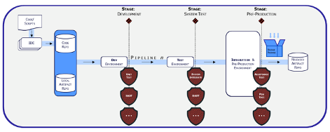
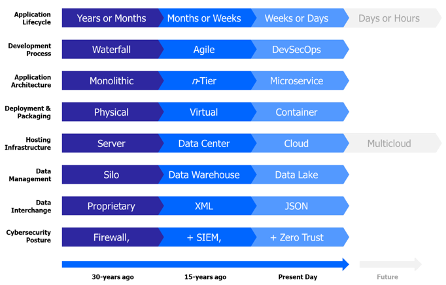

# DevSecOps

# DevSecOps Guiding Principles

*   Relentless pursuit of Agile principles and culture within a software factory construct
    
*   Software factories mandate baked-in security via integral and comprehensive security practices across the entirety of the software supply chain leveraging Zero Trust (ZT) and behavior detection principles.
    
*   Integrated, automated & continuous end-to-end testing and monitoring, from ideation through production, with clearly defined control gates for release candidate promotion
    
*   Immutability of infrastructure achieved via “x as Code” design patterns
    
*   Adoption of Cloud-smart and data-smart architectural motifs throughout
    

# Software Supply Chain Imperatives

*   Use of agile frameworks and user-centered design practices
    
*   Baked-in security across the entirety of the software factory and throughout the software supply chain
    
*   Shifting cybersecurity left
    
*   Shifting both development tests and operational tests left
    
*   Reliance on IaC and CaC to avoid environment drifts between deployments
    
*   Use of a clearly identifiable CI/CD pipeline(s)
    
*   Adoption of Zero Trust principles and a Zero Trust Architecture throughout, both north-south and east-west traffic
    
*   Comprehension and transparency of lock-in decisions, with a preference for avoiding vendor lock-in
    
*   Comprehension and transparency of the cybersecurity stack, with a preference for decoupling it from the application workload
    
*   Centralized log aggregation and telemetry
    
*   Favor small, incremental, and frequent updates over larger, more sporadic releases
    
*   Deployed components must always be replaced in their entirety, never update in place
    

# Software Factory Pipeline

# Governance Guiding Principles

*   Run IT with Mission Discipline: Tie requirements back to your organization’s mission
    
*   Invest in Automation: Automate everything possible, including actions, business processes, decisions, approvals, documentation, and more
    
*   Embrace Adaptability: Accept that change can be required at any time, and all options are available to achieve it
    
*   Promote Transparency: It generates an environment for sharing ideas and developing solutions comprised of Subject Matter Experts (SMEs) or leads from across the enterprise in the form of cross-functional teams to avoid the “silo effect”
    
*   Inherent Accountability: Push down or delegate responsibility to the lowest level reasonable
    

# Software Development over time

# Introduction

DevSecOps is not a security trend by itself. Instead, it is an aspect of the ongoing DevOps revolution. DevSecOps is more of a cultural transformation than a cluster of tools and processes. It enables enterprises leveraging DevOps to think about security _differently_.

Practicing DevSecOps requires an array of purpose-built tools and a wide range of activities that rely on those tools. This document conveys the relationship between each DevSecOps phase, a taxonomy of supporting tools for a given phase, and the set of activities that occur at each phase cross-referenced to the tool(s) that support the specific activity.

## Requirements

Use automation to reduce the human effort needed and improve the accuracy, consistency, and comprehensiveness of security practices throughout the SDLC, as well as provide a way to document and demonstrate use of these practices. Toolchains and tools may be used at different levels of the organization, such as organization-wide or project-specific. 

## Structure

We structure the DevSecOps Processes into the listed stages below:

| Stages |
| --- |
| (Planning) |
| Develop |
| Build |
| Test & Analytics |
| Release |
| Deployment |
| (Operation) |
| (Monitoring) |

Each stage has the following deliverables:

*   Process(es) definition
    
*   Regulatory documents
    
*   Security guidelines
    
*   List of tools, software products employed
    

Based on the deliverables we implement supporting Toolchains. We specify which tools or tool types are to be included in each toolchain and which are mandatory, as well as how the toolchain components are to be integrated with each other. Each tool has been evaluated, selected, and its security assessed.

Tools tables include the below columns:

*   Tool: A specific tool category
    
*   Features: Common characteristics used to describe the tool category
    
*   Benefits: Simple value-proposition of the tool category
    
*   Inputs: Types of data collected by the tool category
    
*   Outputs: Types of artifacts that result from using the tool category
    
*   Baseline: Either a status of REQUIRED or PREFERRED, where required indicates that the tool must be available within the software factory as part of the Minimal Viable Product (MVP) release, and preferred indicates an aspirational capability obtained as the ecosystem matures 
    

## Toolchain Categories

In software, a toolchain is the set of programming tools that is used to perform a complex software development task or to create a software product.

| **Name** | **Description** |     |
| --- | --- | --- |
| DevSecOps Default |     |     |

## Resources

### External

BSA Framework for Secure Software: [https://www.bsa.org/files/reports/bsa\_framework\_secure\_software\_update\_2020.pdf](https://www.bsa.org/files/reports/bsa_framework_secure_software_update_2020.pdf)

Mitigating the Risk of Software Vulnerabilities by Adopting a Secure Software Development Framework (SSDF): [https://nvlpubs.nist.gov/nistpubs/CSWP/NIST.CSWP.04232020.pdf](https://nvlpubs.nist.gov/nistpubs/CSWP/NIST.CSWP.04232020.pdf)

SAFECode, Fundamental Practices for Secure Software Development: [https://safecode.org/wp-content/uploads/2018/03/SAFECode\_Fundamental\_Practices\_for\_Secure\_Software\_Development\_March\_2018.pdf](https://safecode.org/wp-content/uploads/2018/03/SAFECode_Fundamental_Practices_for_Secure_Software_Development_March_2018.pdf)

US DoD DevSecOps Playbook: [https://dodcio.defense.gov/Portals/0/Documents/Library/DevSecOps%20Playbook\_DoD-CIO\_20211019.pdf](https://dodcio.defense.gov/Portals/0/Documents/Library/DevSecOps%20Playbook_DoD-CIO_20211019.pdf)

[DevSecOps Fundmentals Guidebook (defense.gov)](https://dodcio.defense.gov/Portals/0/Documents/Library/DevSecOps%20Fundamentals%20Guidebook-DevSecOps%20Tools%20and%20Activities_DoD-CIO_20211019.pdf)

DoD tools and activities playbook: [https://software.af.mil/wp-content/uploads/2021/05/DoD-Enterprise-DevSecOps-2.0-Tools-and-Activities-Guidebook.pdf](https://software.af.mil/wp-content/uploads/2021/05/DoD-Enterprise-DevSecOps-2.0-Tools-and-Activities-Guidebook.pdf)

Software Assurance Forum for Excellence in Code (SAFECode), _Practical Security Stories and Security Tasks for Agile Development Environments:_ [https://safecode.org/publication/SAFECode\_Agile\_Dev\_Security0712.pdf](https://safecode.org/publication/SAFECode_Agile_Dev_Security0712.pdf)
